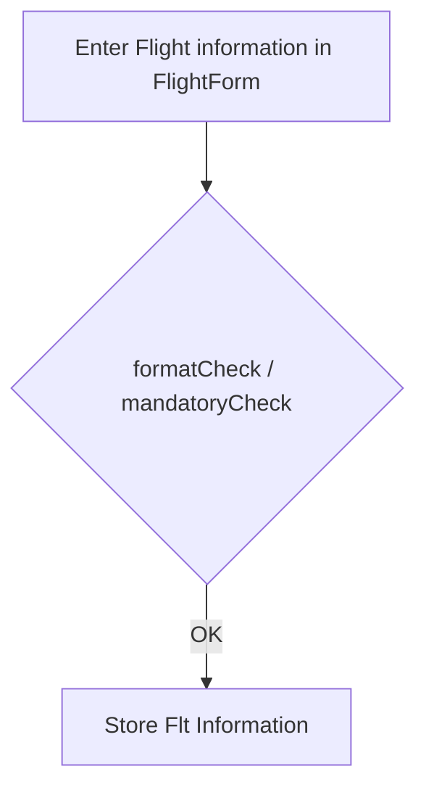

# ✈️ myFlights ✈️

### by 🐣 schlaepfAIR

With this python tool you wil have the possibility to save all your Flights, so you create your own Flightdiary!
In addition to your Flightdiary you will see your savings for each fliht

## Idea of Features

##### Flight Form:

- Entering all the relevant Flightinformation

##### Overview / Statistic:

- Chronological list view of entered flights, including savings
- Filterfunctionality (Date, Airline, Departure)
- Overview for all savings, filtering per year, airline, etc

##### _Optional_:

- Get Airline and/or Airport detailed information from a external source (openAPI)
- Share your diary via export or link

flowchart LR
id

flowchart TD
Start --> Stop

_schlaepfAIR is a DBM parttime student @ the FHGR in Chur and learning more interesting python stuff during the spring semester 2022. In addition this guy works for an airline and is travelling around the world with high employe discounts in the fares_
